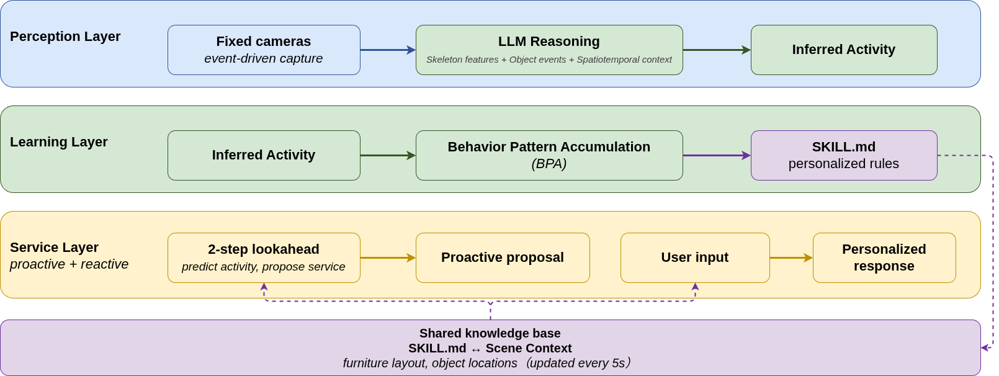
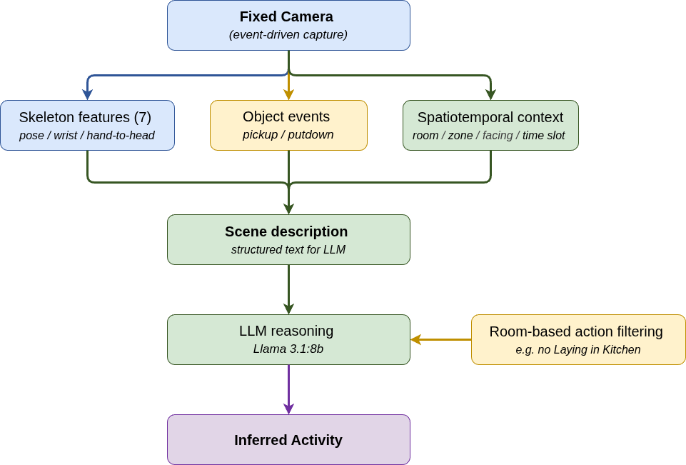
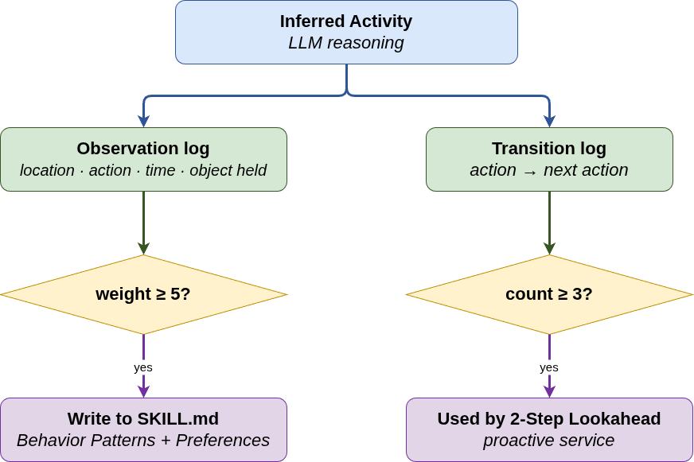
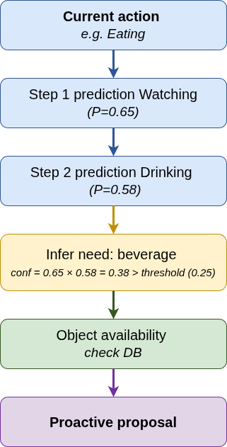
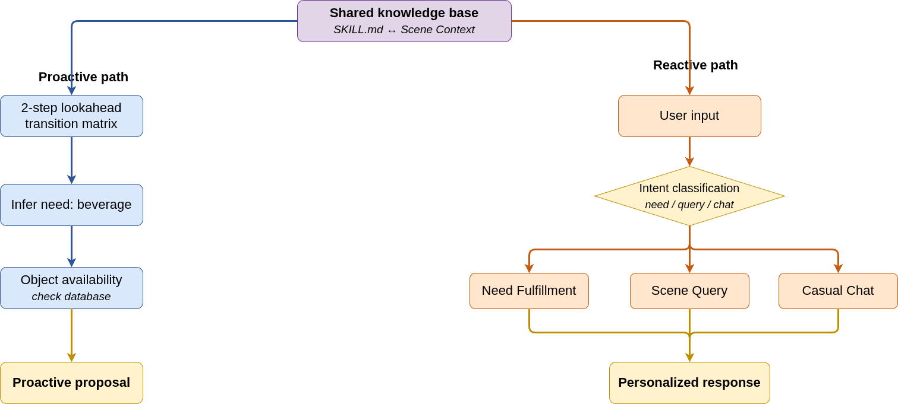

# Personalized Home Service Agent — Backend (Perception, Behavioral Learning & Proactive Service)

**LLM-driven multimodal activity recognition and proactive service prediction for smart home robotics — no per-action model training required.**

[](https://www.python.org/)
[](https://flask.palletsprojects.com/)
[](https://www.mongodb.com/)
[](https://ollama.com/)

> Backend of a Master's thesis project: *Personalized Home Service Agent Based on Spatiotemporal Behavioral Reasoning via Multi-Camera Observation*, Dept. of Computer Science and Information Engineering, National Cheng Kung University.
> Unity simulation environment (companion repo): **[env3](https://github.com/wenny2377/env3)**
> Demo video: **[YouTube](https://youtu.be/uyH-45L20tk?si=8OR7oPYNtSubhiSS)**

---

## Overview

Most home service robots either need users to actively voice their requests, or rely on wearable/IoT sensors and large labeled datasets to learn habits. This project explores a different path: **a fixed-camera, vision-only pipeline that lets a Large Language Model (LLM) reason about what a person is doing, quietly accumulate their behavioral patterns, and proactively offer help before they ask.**

This is a **Proof-of-Concept** system, validated in a controlled Unity simulation — not a production deployment. The goal was to test the technical feasibility of the full pipeline end-to-end, from raw perception cues to a proactive suggestion.

**The core contribution is the proactive service mechanism** (2-Step Lookahead): everything else — activity recognition, behavior pattern accumulation, context injection — exists to make that final step possible.

---

## Why this is interesting

- **No fine-tuning, no per-action training data.** Activity recognition is done by turning skeleton geometry, object interaction events, and spatial context into a natural-language scene description, then asking an LLM (Llama 3.1:8b, via Ollama) to reason about the most likely activity. Adding a new activity class is a config change, not a retraining job.
- **Proactive, not just reactive.** A lightweight behavior-transition model (2-Step Lookahead) predicts what a user is likely to need next — e.g., after `Eating`, the system may predict `Watching` → `Drinking` and proactively offer a drink — without waiting for a spoken request.
- **Passive personalization.** A Behavioral Pattern Accumulation (BPA) mechanism builds a per-user profile (`SKILL.md`) purely from repeated observation — no explicit preference input required.
- **Hallucination-aware dialogue.** Real-time environment state (object locations, device states) is injected into every LLM prompt, so the assistant answers "where's my cola?" with a real location instead of a guess.

---

## System Architecture

The system is organized into three functional layers:



| Layer | Responsibility |
|---|---|
| **Perception Layer** | Fixed cameras trigger on stillness → skeleton features + object events + spatiotemporal context → LLM reasoning → inferred activity |
| **Learning Layer** | Behavioral Pattern Accumulation (BPA): observation log (→ `SKILL.md`) and transition log (→ 2-Step Lookahead) |
| **Service Layer** | Reactive (intent classification: need / query / chat) and proactive (2-Step Lookahead) service paths, both grounded in `SKILL.md` and live scene context |

### Perception pipeline



Three complementary information sources are fused into a single natural-language scene description before being handed to the LLM:

- **Skeleton features** (7 geometric values derived from body keypoints — tilt angle, knee bend ratio, head pitch, hand-to-head distance, arm elevation)
- **Object interaction events** (pickup/putdown timestamps — the single most informative cue; removing it drops accuracy from 88.4% to 22.2% in ablation)
- **Spatiotemporal context** (room, time slot, facing direction, nearby furniture, device state)

A separate VLM-only pipeline (Gemma 3:4b, direct image inference) is implemented purely as a **comparison baseline** to evaluate structured-reasoning vs. pure-vision approaches — it is not part of the main recognition path.

### Behavioral Pattern Accumulation (BPA)



Two parallel logs, both built entirely from passive observation:

- **Observation log** — when a (user, zone, action, time-slot) combination is observed enough times, it's written into that user's `SKILL.md`
- **Transition log** — action-to-action transition counts feed the 2-Step Lookahead predictor

### Proactive service (2-Step Lookahead)



A two-step transition-probability lookahead predicts the user's likely next need and checks object availability before proposing a service — entirely before the user says anything.

### Service layer (reactive + proactive)



---

## Results (Proof-of-Concept evaluation)

Evaluated in a Unity 3D simulation over a 7-day virtual observation window, two virtual users with distinct behavioral profiles, 10 daily activity classes, 189 evaluated episodes.

| Experiment | Result |
|---|---|
| HAR accuracy (Baseline) | **88.4%** (structured reasoning) vs. **81.0%** (VLM-only baseline) |
| HAR accuracy under heavy compound noise | **74.1%** (35% pickup-event loss, 20% object-label confusion, 15° skeleton noise) |
| Modality ablation — remove object events | −66.1 pp (88.4% → 22.2%) — most critical single cue |
| Modality ablation — remove skeleton | −30.7 pp (88.4% → 57.7%) |
| Modality ablation — remove spatial context | −16.9 pp (88.4% → 71.4%) |
| Personalization check | BPA correctly separates two users' behavioral profiles from its own (imperfect) observations, without ground truth |

*(Full methodology, thresholds, and discussion of limitations are in the accompanying thesis.)*

---

## Tech Stack

| Component | Choice |
|---|---|
| Backend | Python 3.10, Flask REST API |
| LLM | Llama 3.1:8b (reasoning core) |
| VLM | Gemma 3:4b (comparison baseline only) |
| Local inference serving | Ollama |
| Database | MongoDB |
| Semantic similarity | Sentence-BERT (`all-MiniLM-L6-v2`) |
| Simulation client | Unity 3D (see [env3](https://github.com/wenny2377/env3)) |

Runs fully on a single consumer GPU (RTX 2080, 8 GB VRAM) — no cloud inference.

---

## Repository structure

```
modules/
  perception/   PerceptionEngine, SceneEngine, build_scene_text()   → Perception Layer
  memory/       HabitLearner, PatternAnalyzer, SkillManager,
                ObservationStore                                    → Learning Layer (BPA)
  service/      ReactiveService, ProactiveService, ProposalManager  → Service Layer
  utils/        ObjectClassifier
app.py          Flask entry point / REST API
config.py       Central configuration
analysis/       Experiment scripts (HAR baseline, corruption robustness,
                modality ablation, behavior-pattern differentiation)
```

---

## Related work

- Simulation / Unity client: **[env3](https://github.com/wenny2377/env3)**
- Demo video: **[YouTube](https://youtu.be/uyH-45L20tk?si=8OR7oPYNtSubhiSS)**

---

## Limitations (honest PoC scope)

This is a research prototype validated in simulation, not a deployed system:

- Skeleton features are read directly from Unity's animation rig, not from a real pose-estimation model — thresholds will need recalibration against real vision pipelines.
- Object localization uses ground-truth positions from the simulator; a compatible real-world multi-camera object localization pipeline is designed but not yet integrated.
- The proactive service mechanism is validated for technical feasibility (does it trigger correctly, is the prediction logic sound), not for real-user acceptance or timing appropriateness — that requires a real deployment study.

